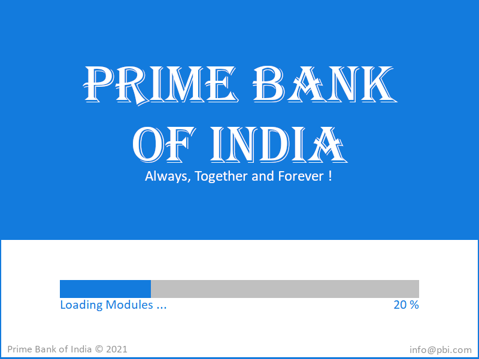
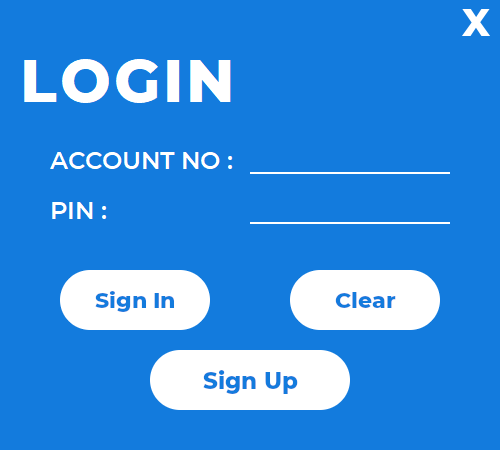
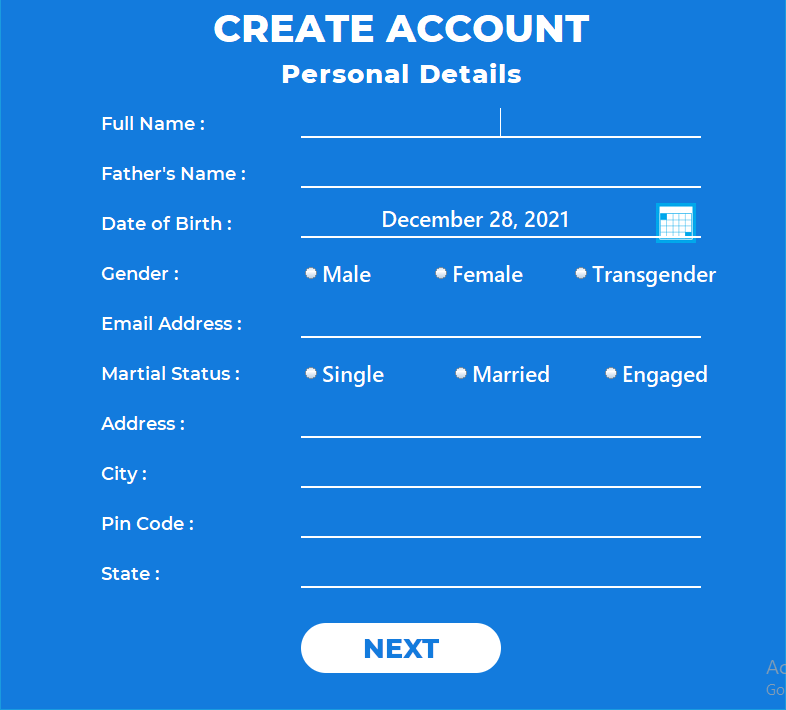
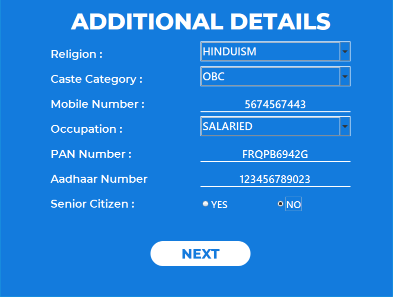
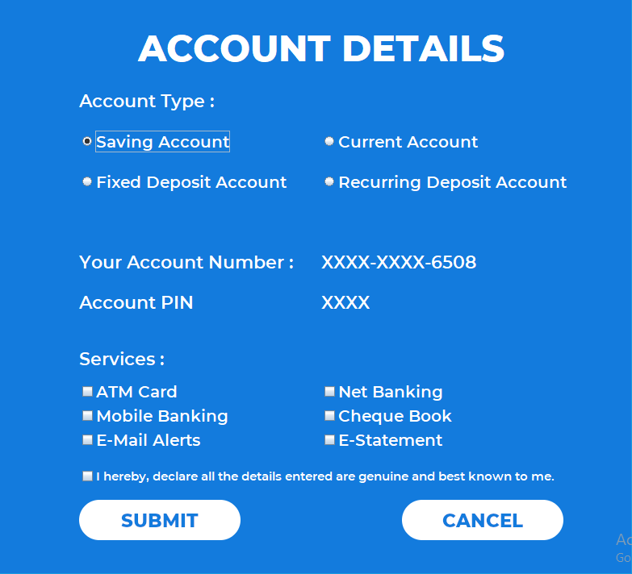
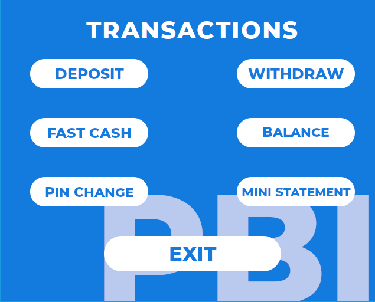
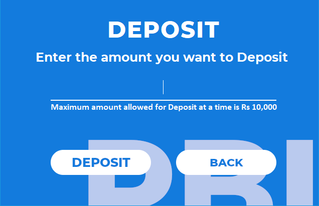
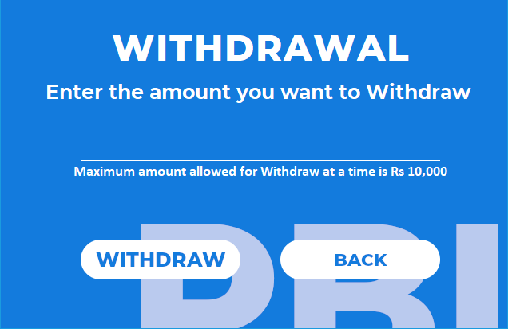

# Virtual Banking System
A simple idea using <b>Java Swing</b> and <b>MySQL</b> about a simple virtual banking system installed. The Project shares a Look a like ATM System. The Project is a <b>Full Stack Java Project</b>. UI/UX is designed using <b>Java 8 swing</b>, the DBMS used is <b><i>SQL</i></b>

## Scope
Using the fundamentals of the project advanced system can be designed with more advanced security system and Banking System Fundamentals.

### Outputs
       
